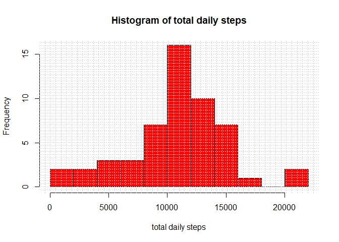
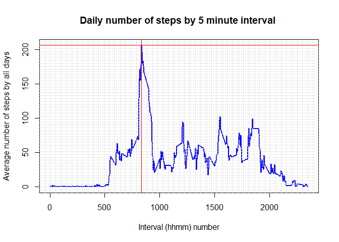
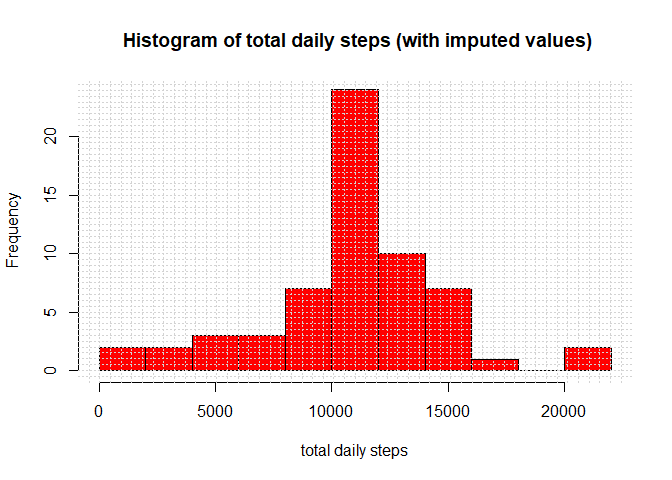
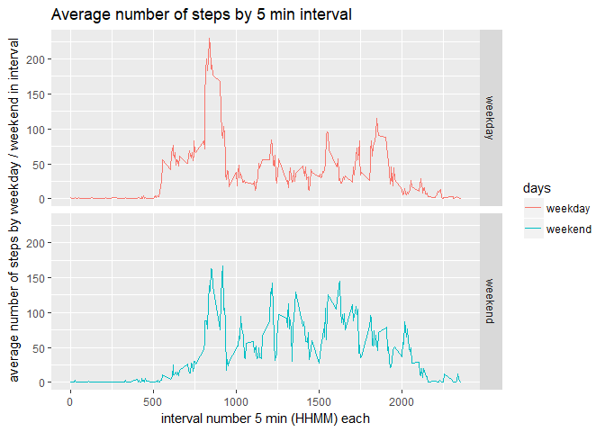

## Loading and preprocessing the data

```r
library(dplyr)
if (!file.exists("./figure"))
    dir.create("./figure")
## 1.1 get file, unzip file, read table
localFile <- paste0(wd,"./activity.zip")
unzip(localFile, exdir = wd, overwrite = TRUE )
##
## 1.2read into table and get daily sums of the steps
##
activity <- read.table("activity.csv",sep=",",header=TRUE)
## summarize by day
dailysteps <- activity %>% group_by(date) %>% summarize(sum(steps))
names(dailysteps) <-c("date","totalsteps")                                                        
##
```

## What is mean total number of steps taken per day?

```r
##
## 2.1. make histogram and show mean/median daily steps
hist(dailysteps$totalsteps,breaks =10,col="red", #breaks=nrow(dailysteps)+1
main = " Histogram of total daily steps ",
xlab = "total daily steps")
grid(52, col = "lightgray", lty = "dotted",lwd = par("lwd"))
```

<!-- -->

```r
##
print(sprintf("Mean   daily steps : %8.2f",mean(dailysteps$totalsteps,na.rm=TRUE)))
```

```
## [1] "Mean   daily steps : 10766.19"
```

```r
print(sprintf("Median daily steps : %d"   , median(dailysteps$totalsteps,na.rm=TRUE)))
```

```
## [1] "Median daily steps : 10765"
```

```r
## save plot as pdf file in doc
dev.copy(png,file="./figure/1_hist_daily_steps.png",height=480,width=480)
```

```
## png 
##   5
```

```r
dev.off()
```

```
## RStudioGD 
##         2
```

## What is the average daily activity pattern?

```r
##
## 3.1. summarize number of steps by interval ( mean for all days)
##
intervalsteps <-   activity %>% group_by(interval) %>% summarize(mean(steps,na.rm=TRUE)) 
#intervalsteps["interval_number"]  <- NA
#intervalsteps$interval_number = as.integer(floor(intervalsteps$interval/100)*12 + (intervalsteps$interval %% 100)/5)
#intervalsteps["HHMM"] <- NA
#intervalsteps$HHMM = sprintf("%02d:%02d",
#                             floor(intervalsteps$interval/100),floor(intervalsteps$interval%%100))
#f <- with(intervalsteps ,strptime(sprintf("%04d",interval),"%H%M")) 
names(intervalsteps) <- c("interval","meanbyday") #,"interval_number") ##,"HHMM")
##
## 3.2. make plot and show max value and inteval where it reached
##
with(intervalsteps ,plot(interval,meanbyday,pch=3, ##interval_number
                         col="blue",type="l",lwd=2, 
                         main="Daily number of steps by 5 minute interval ",
                         xlab = "Interval (hhmm) number",
                         ylab = "Average number of steps by all days"))
grid(52, col = "lightgray", lty = "dotted",lwd = par("lwd"))
abline(h=max(intervalsteps$meanbyday),col="red")
max_interval_number <- with(intervalsteps,which.max(meanbyday))
max_interval = floor((max_interval_number-1)/12)*100 + ((max_interval_number-1)%%12)*5
abline(v=max_interval,col="red")
```

<!-- -->

```r
print(sprintf("5 min interval (hh:mm) with maximum average steps by days is: %02d:%02d",
              floor(max_interval/100),max_interval%%100))
```

```
## [1] "5 min interval (hh:mm) with maximum average steps by days is: 08:35"
```

```r
## save plot as pdf file in doc
dev.copy(png,file="./figure/2_daily_average.png",height=480,width=480)
```

```
## png 
##   5
```

```r
dev.off()
```

```
## RStudioGD 
##         2
```


## Imputing missing values

```r
##
## 4.1 Report missing values and impute missing values
##
nmissing <- sum(is.na(activity$steps))
print(sprintf("Total number of missing steps: %d out of %d (%4.2f%%)",
              nmissing,nrow(activity),(nmissing*100)/nrow(activity)))
```

```
## [1] "Total number of missing steps: 2304 out of 17568 (13.11%)"
```

```r
ndayilymissing <- sum(is.na(dailysteps$totalsteps))
print(sprintf("Total number of missing daily steps: %d out of %d (%4.2f%%)",
              ndayilymissing,nrow(dailysteps),(ndayilymissing*100)/nrow(dailysteps)))
```

```
## [1] "Total number of missing daily steps: 8 out of 61 (13.11%)"
```

```r
nintervalmissing<-sum(is.na(intervalsteps$meanbyday))
print(sprintf("Total number of missing mean interval steps: %d out of %d (%4.2f%%)",
              nintervalmissing,nrow(intervalsteps),
              (nintervalmissing*100)/nrow(intervalsteps)))
```

```
## [1] "Total number of missing mean interval steps: 0 out of 288 (0.00%)"
```

```r
newactivity <- activity
for(i in 1:nrow(newactivity)) {
  if (is.na(newactivity[i,"steps"])) {
    inter <- newactivity[i,"interval"]
    interval_number <- as.integer(floor(inter/100)*12 + (inter %% 100)/5) +1
    newactivity[i,"steps"] <- as.integer(intervalsteps[interval_number, "meanbyday"])
  }
}

nmissing <- sum(is.na(newactivity$steps))
print(sprintf("Total number of missing steps after imputing : %d out of %d (%4.2f%%)",
              nmissing,nrow(newactivity),(nmissing*100)/nrow(newactivity)))
```

```
## [1] "Total number of missing steps after imputing : 0 out of 17568 (0.00%)"
```

```r
##
## 4.2. Make histogram with imputed values
##
dailysteps <- newactivity %>% group_by(date) %>% summarize(sum(steps))
names(dailysteps) <-c("date","totalsteps")                                                        
##
##  make histogram and show mean daily steps
hist(dailysteps$totalsteps,breaks=10,col="red", ## nrow(dailysteps)+1
     main = " Histogram of total daily steps (with imputed values)",
     xlab = "total daily steps")
grid(52, col = "lightgray", lty = "dotted",lwd = par("lwd"))
```

<!-- -->

```r
print(sprintf("Mean   daily steps : %8.2f",mean(dailysteps$totalsteps,na.rm=TRUE)))
```

```
## [1] "Mean   daily steps : 10749.77"
```

```r
print(sprintf("Median daily steps : %d"   , median(dailysteps$totalsteps,na.rm=TRUE)))
```

```
## [1] "Median daily steps : 10641"
```

```r
## save plot as pdf file in doc
dev.copy(png,file="./figure/3_hist_daily_steps_imputed.png",height=480,width=480)
```

```
## png 
##   5
```

```r
dev.off()
```

```
## RStudioGD 
##         2
```

## Are there differences in activity patterns between weekdays and weekends?

```r
##
## 5.1 Get weekday & weekend data tables
##
newactivity["weekday"] <- NA
newactivity$weekday =  ((wday(as.Date(newactivity$date)) > 1) & (wday(as.Date(newactivity$date)) < 7)) 
newactivity["days"] <- NA
x <- c("weekend","weekday")
newactivity$days <- x[as.integer(newactivity$weekday)+1] 
intervalsteps <-   newactivity %>% group_by(interval,days) %>% summarize(mean(steps,na.rm=TRUE)) 
intervalsteps["interval_number"]  <- NA
intervalsteps$interval_number = as.integer(floor(intervalsteps$interval/100)*12 + (intervalsteps$interval %% 100)/5)
names(intervalsteps) <- c("interval","days","meanbyday","interval_number")
##
## 5.2. Plots of average number of steps with 2 faces - weekday, weekend
##
library(ggplot2)
qplot(interval,meanbyday,data=intervalsteps,
      facets=days~.,geom="line",col=days,
      main="Average number of steps by 5 min interval ",
      xlab = "interval number 5 min (HHMM) each",
      ylab = "average number of steps by weekday / weekend in interval")
```

<!-- -->

```r
dev.copy(png,file="./figure/4_weekday_weekend.png",height=480,width=480)
```

```
## png 
##   5
```

```r
dev.off()
```

```
## RStudioGD 
##         2
```

